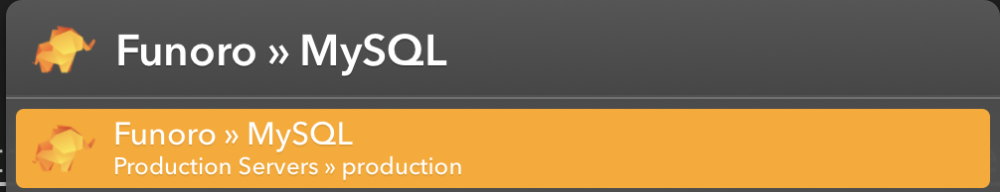
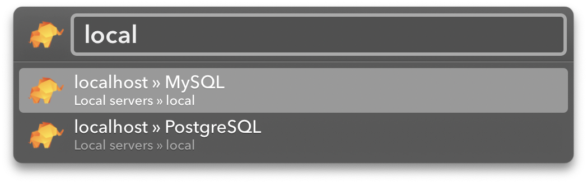

# [Setapp] TablePlus Action for Launchbar

This is a fork of [mludi/launchbar-tableplus](https://github.com/mludi/launchbar-tableplus) with tweaks that make it work with the [Setapp](https://setapp.com) version of [TablePlus](https://tableplus.com).

Thanks to [Matthias Ludwig](https://github.com/mludi) for building an awesome Launchbar action ♥️

--

An ultra-fast [TablePlus](https://tableplus.io) search workflow for [Launchbar 6](https://www.obdev.at/products/launchbar/index.html).

## Installation

1. [Download the latest version](https://github.com/mludi/launchbar-tableplus/releases/latest)
2. Install the action by double-clicking the `TP.lbaction` file

## Usage

Just type `TP` and press enter to get a list of all connections.



Just type `TP` followed by your search query.



```
TP <query>
```

E.g.

```
TP local
```

press `<enter>` to open the connection.

## Credits

Thanks to [huyphams](https://github.com/huyphams) for a great app and using the icon 💙.

Thanks to [chrisrenga](https://github.com/chrisrenga/alfred-tableplus) for the inspiration 💙!
